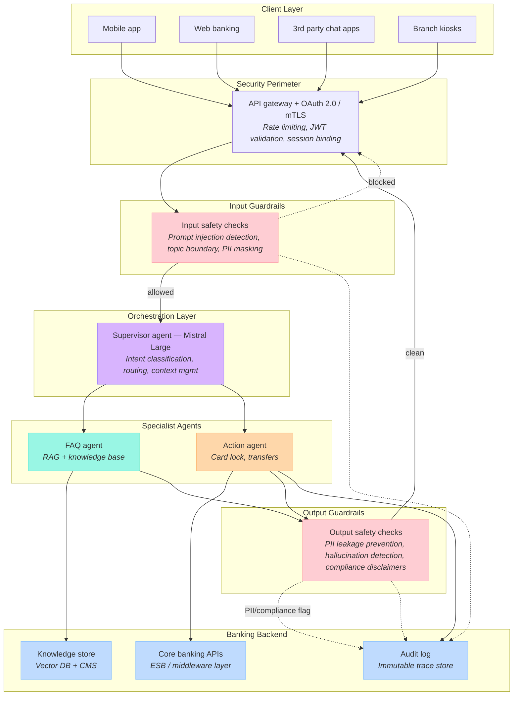
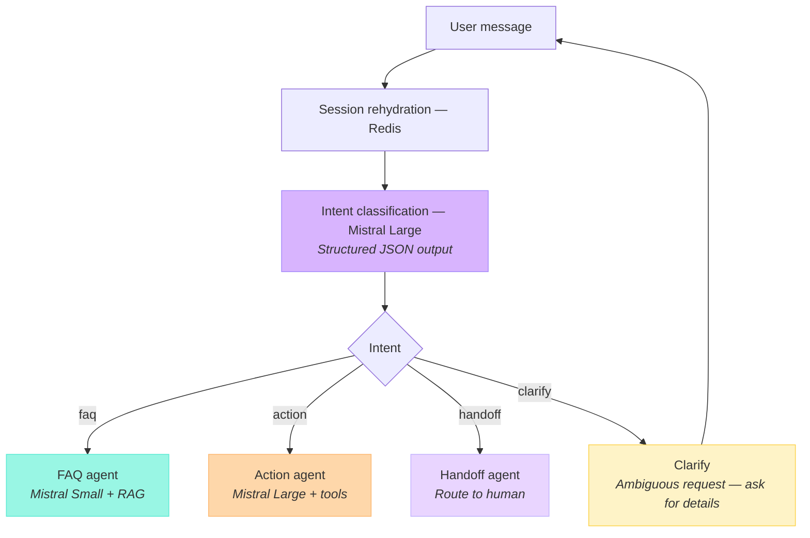
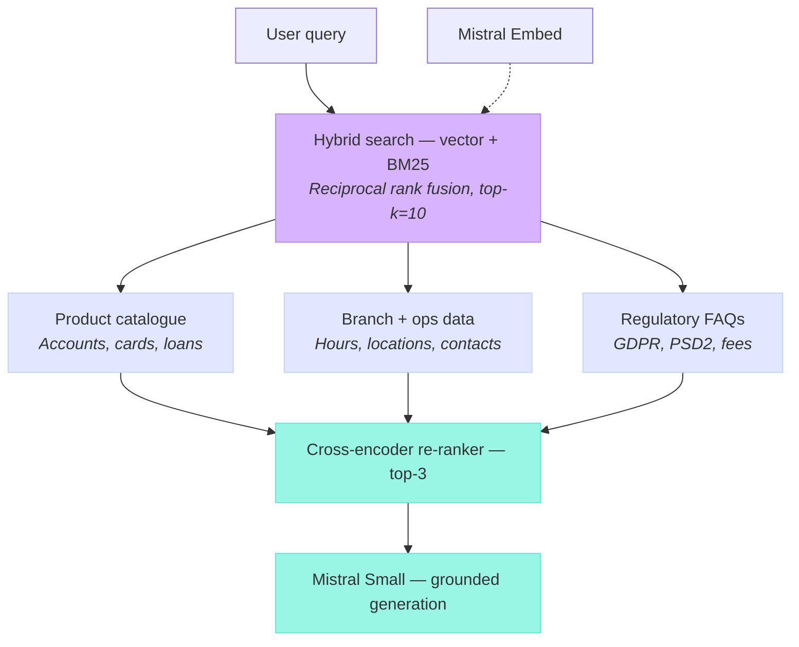
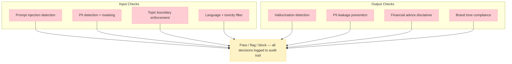
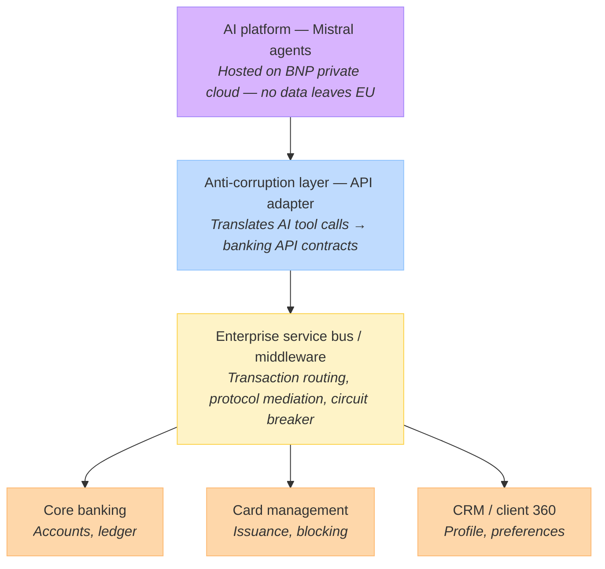
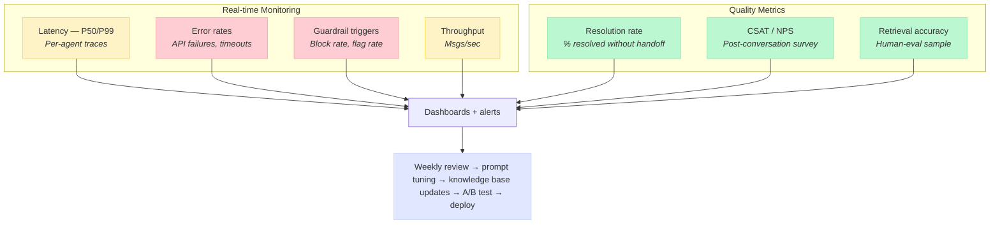

# BNP Paribas Retail Banking AI Assistant — Technical Architecture & Deployment Strategy

## 1. Strategic framing

Before diving into architecture, let me ground us on why the design choices matter. BNP's retail banking context imposes constraints you won't find in a typical SaaS chatbot: PSD2/DSP2 regulatory compliance for payment operations, GDPR for data residency, the ACPR's expectations around AI explainability, and the reality that your core banking systems — likely a mix of mainframe COBOL and more recent API layers — aren't going away. The architecture must respect these boundaries while delivering sub-2-second response times for FAQ queries and sub-5-second end-to-end for transactional operations.

The system I'm proposing uses a multi-agent orchestration pattern built on Mistral models, with a dedicated supervisor agent routing to specialized sub-agents for FAQ resolution and transactional execution. Let me walk you through the layers.

### High-level system architecture

> Purple = orchestration · Teal = retrieval · Coral = execution · Pink = safety (input + output) · Blue = infrastructure

This is the 30,000-foot view. Let me now break down each critical layer, starting with the orchestration logic — the brain of the system.

## 2. The supervisor agent — intent routing and context management

The supervisor agent is the single entry point for all user messages. It runs on Mistral Large (for its superior reasoning on ambiguous intents) and performs three functions: classify the user's intent, maintain conversational context across turns, and route to the appropriate specialist. Critically, it never directly accesses banking systems — it delegates everything.

Intent classification uses a structured output schema. The supervisor produces a JSON decision object that includes the detected intent category, extracted entities (account IDs, card references, amounts), and the target agent. When the request is ambiguous, the supervisor routes to a clarification turn rather than guessing — in banking, a misrouted "lock my card" is not a minor error. The model's prompt includes explicit rules for when to clarify (e.g., user has multiple cards but didn't specify which one), which is more reliable than a numeric confidence threshold.

The context window carries a compressed session state: the authenticated user's profile (pre-loaded at session start via the API gateway), the last N turns, and any pending action confirmations. This is not stored in the model's context alone — a Redis-backed session store holds the canonical state, and the supervisor rehydrates from it on each turn.

### Supervisor agent routing flow

> Guardrails run on every turn — input checks before routing, output checks before responding (see diagram 1)

A few design decisions worth highlighting here. The clarification loop is not a failure state — it's a safety mechanism. When a user says "block my card," the supervisor needs to determine: which card? Debit or credit? Temporary or permanent? Rather than assuming, it asks. This is especially important given that BNP customers may have multiple products across retail portfolios.

The handoff agent deserves attention too. Not every conversation can or should be resolved by AI. Complaints, disputes, complex product advisory — these route to a human agent with the full conversation transcript attached. The handoff should be seamless: no "please call us at," but a warm transfer into your existing contact center platform (Genesys, Nice, or whatever BNP runs).

## 3. The FAQ agent — RAG architecture

The FAQ agent handles the highest volume of queries: branch hours, account balances, product information, fee schedules, regulatory questions. It runs on Mistral Small for cost efficiency and latency (sub-500ms inference), paired with a retrieval-augmented generation pipeline.

The RAG pipeline has several deliberate design choices worth defending.

### FAQ agent — retrieval-augmented generation

**Hybrid search over pure vector search.** Banking queries are often exact-match sensitive: "Livret A rate" needs the precise product name matched, not a semantic neighbor. BM25 catches these; vector search catches the paraphrased versions ("what interest do I get on my savings"). Reciprocal rank fusion merges both signals without requiring a learned fusion model.

**Cross-encoder re-ranking.** The initial retrieval is cheap and broad (top-10). The re-ranker is expensive but precise — it scores each query-document pair with full cross-attention. This two-stage approach keeps latency under 300ms for the retrieval step while dramatically improving relevance.

Account-specific data (like "what's my balance?") does not go through RAG at all. The supervisor detects these as account queries and routes them to a thin API call via the banking middleware, injecting the result into the FAQ agent's prompt as structured data. The vector database never stores PII or account-level information.

**Knowledge base maintenance** is a first-class concern. BNP's product catalog, fee schedules, and regulatory information change. The ingestion pipeline must support incremental updates with version control — when a fee changes, the old chunk is tombstoned and the new one is embedded and indexed. I'd recommend a nightly sync from BNP's CMS with a manual trigger for urgent regulatory updates.

## 4. The action agent — transactional execution

This is the high-stakes agent. When a customer says "lock my credit card," the system must execute that action against BNP's core banking platform — correctly, securely, and with an audit trail.

The non-negotiable principle here is **double confirmation before any state-changing operation**. The flow is: the agent extracts what it thinks the user wants, presents it back in plain language for explicit confirmation ("You want to temporarily lock your Visa ending in 4821 — is that correct?"), then triggers PSD2-compliant Strong Customer Authentication before executing.

### Action agent — transactional execution flow

```mermaid
flowchart TD
    A[Supervisor routes action intent] --> B[Entity extraction + validation<br/><i>Card ID, action type, scope</i>]
    B --> C[Explicit user confirmation<br/><i>&quot;Lock Visa ****4821 temporarily? Yes/No&quot;</i>]
    C --> D[Step-up authentication<br/><i>OTP / biometric via SCA — PSD2</i>]
    D --> E[Mistral function call → banking API<br/><i>POST /cards/&#123;id&#125;/lock via ESB middleware</i>]
    E --> F[Response parsing + confirmation<br/><i>Success/failure → user-facing message</i>]
    E --> G[Audit log<br/><i>Immutable</i>]
    F --> H[Retry / rollback / escalate to human]

    style A fill:#d8b4fe,stroke:#a78bfa
    style B fill:#fef3c7,stroke:#fcd34d
    style C fill:#bbf7d0,stroke:#86efac
    style D fill:#bfdbfe,stroke:#93c5fd
    style E fill:#fed7aa,stroke:#fdba74
    style F fill:#fed7aa,stroke:#fdba74
    style G fill:#fecdd3,stroke:#fda4af
```

Mistral's function calling is the mechanism for the actual API invocation. The action agent has a defined tool schema — a set of banking operations it's allowed to call, with strict parameter typing. It cannot improvise API calls. The available tool set is defined declaratively and version-controlled:

- `lock_card(card_id, lock_type: temporary|permanent)`
- `unlock_card(card_id)`
- `get_balance(account_id)`
- `initiate_transfer(from_account, to_account, amount, currency)`
- `get_transactions(account_id, date_range)`
- `update_contact_info(field, new_value)`

Each tool maps to a specific endpoint on BNP's ESB/middleware layer. The agent never talks directly to the core banking mainframe — the middleware handles protocol translation, transaction semantics, and error handling.

**Idempotency is critical.** If the middleware call times out, the action agent must not blindly retry a card lock. Each operation carries a client-generated idempotency key, and the middleware layer de-duplicates.

## 5. The guardrails agent — safety and compliance

This agent runs in parallel on every single turn, not as a post-processing step. It inspects both the user's input and the system's proposed output before anything reaches the user or the banking API.

Let me expand on the guardrails that are specific to BNP's banking context.

### Guardrails agent — parallel safety layer

**Prompt injection detection** uses Mistral's moderation endpoint combined with a fine-tuned classifier. Banking chatbots are high-value targets — an attacker who can jailbreak the bot into revealing account data or executing unauthorized transactions has a direct financial incentive. The classifier is trained on banking-specific injection patterns, not just generic ones.

**Topic boundary enforcement** is about keeping the bot in its lane. The assistant must not provide investment advice, tax guidance, or insurance recommendations unless explicitly scoped to do so with appropriate disclaimers. It should deflect political questions, personal opinions, and anything outside the retail banking domain. This is implemented as a lightweight Mistral Small classifier that runs on each turn and returns a binary allow/block signal.

**Hallucination detection** on the output side cross-references the generated response against the retrieved chunks. If the model asserts a fee amount or interest rate that doesn't appear in the source documents, the guardrail flags it. This is particularly important for BNP — stating an incorrect Livret A rate or fee schedule isn't just unhelpful, it's a potential regulatory issue.

**Financial advice disclaimers** are automatically injected when the model's response touches investment products, loan recommendations, or insurance — even if the user didn't explicitly ask for advice. This is a regulatory requirement under MiFID II.

## 6. Integration with BNP's legacy systems

Now let me address the elephant in the room: BNP's core banking infrastructure. Like most large European banks, BNP likely runs a mix of mainframe systems (potentially COBOL-based for core accounts), a middleware/ESB layer, and more modern API gateways for mobile and web. The AI assistant cannot bypass this layered architecture — nor should it.

The **anti-corruption layer** is a critical architectural component. It sits between the AI platform and BNP's existing middleware, serving as a contract translator. The AI agents speak in tool-call JSON — structured, typed, version-controlled. The banking APIs may speak SOAP, REST, or proprietary protocols. The anti-corruption layer handles that translation without polluting either side's domain model.

### Banking system integration layers

> All infrastructure within EU — GDPR Article 44+ compliant data residency

This layer also implements **circuit breakers**. If the core banking system is experiencing degraded performance (which happens during batch processing windows, typically overnight), the circuit breaker trips and the action agent gracefully tells the user: "I can't process this right now — I'll notify you when the service is back, or you can try again in a few minutes." It does not retry indefinitely and it does not fail silently.

**Data residency is non-negotiable.** The entire AI platform — model inference, vector storage, session state, audit logs — runs on BNP's private cloud infrastructure within the EU. No customer data transits to Mistral's hosted API endpoints. We deploy the models on-premise or in BNP's VPC using Mistral's enterprise deployment options.

## 7. Observability and continuous improvement

A production AI system without observability is a liability. Here's the monitoring stack I'd propose.

### Observability and feedback loops

Every conversation is traced end-to-end using distributed tracing (OpenTelemetry). Each agent invocation — supervisor classification, FAQ retrieval, action execution, guardrail check — is a span in the trace. This means when latency spikes or an error occurs, you can pinpoint exactly which component caused it.

The feedback loop is where the system gets smarter over time. Conversations that result in human handoff are reviewed weekly. Common failure patterns — misclassified intents, poor retrievals, hallucinated answers — feed back into prompt tuning, knowledge base enrichment, and fine-tuning data. This is not a "launch and forget" system.

## 8. Project phasing and deployment plan

Now let me lay out the timeline. This is a phased rollout designed to minimize risk while delivering value incrementally.

The phasing logic follows a risk gradient.

| Phase | Name | Timeline | Key Deliverables |
|-------|------|----------|-----------------|
| **Phase 1** | Foundation + FAQ pilot | Weeks 1–8 | Infrastructure setup (private cloud, vector DB, Redis) · Knowledge base ingestion from BNP's CMS · FAQ agent with RAG pipeline · Guardrails agent v1 · Internal testing with BNP ops team · Deploy to 5% of web banking traffic (shadow mode, human reviews all responses) |
| **Phase 2** | FAQ scale-up + action agent (read-only) | Weeks 9–14 | FAQ agent to 60% traffic · Action agent with read-only operations (balance inquiry, transaction history) · Supervisor agent with intent routing · Step-up authentication integration · A/B testing framework live · Mobile app channel integration |
| **Phase 3** | Write operations + multi-channel | Weeks 15–22 | Card lock/unlock (first write operation) · Transfer initiation (with double confirmation + SCA) · Contact info updates · WhatsApp channel · Full guardrails v2 with hallucination detection · 100% FAQ traffic, 25% action traffic |
| **Phase 4** | Full production + optimization | Weeks 23–30 | 100% traffic on all operations · Branch kiosk integration · Proactive notifications (fraud alerts, payment reminders) · Fine-tuning on BNP conversation data · Advanced analytics dashboard · Handoff to BNP internal AI team for ongoing operations |

**Phase 1** is the safest possible deployment: FAQ-only, shadow mode, human-in-the-loop on every response. We're validating retrieval quality, latency, and guardrail effectiveness before any customer sees an unreviewed answer.

**Phase 2** introduces the supervisor and action agent but only for read operations — balance checks, transaction history. These are high-value for the user but carry zero risk of unintended state changes.

**Phase 3** is where it gets real: write operations. Card locking is the ideal first write operation because it's high-urgency (the user genuinely wants it done fast), low-complexity (binary action, one entity), and reversible (a locked card can be unlocked). Transfers come next with the full double-confirmation and SCA flow.

**Phase 4** is production maturity: full traffic, proactive capabilities, and — critically — the handoff to BNP's internal team. Mistral provides the platform and the initial build, but BNP's AI engineering team needs to own the ongoing operation, prompt tuning, and knowledge base maintenance.

## 9. Model selection rationale

Let me briefly justify the Mistral model choices across the stack.

**Mistral Large** powers the supervisor agent and the action agent. The supervisor needs strong reasoning for ambiguous intent classification — a user saying "I can't use my card" could mean they want to report fraud, their card is physically damaged, or they're confused about a declined transaction. Mistral Large's instruction-following precision and its structured output capabilities make it the right choice. The action agent needs Mistral Large because function-calling accuracy on banking operations must be near-perfect — there's no room for parameter hallucination.

**Mistral Small** powers the FAQ agent and the guardrails classifiers. FAQ generation is high-volume, lower-complexity — the heavy lifting is done by the retrieval pipeline, and the model's job is to synthesize retrieved chunks into a coherent answer. Mistral Small keeps inference costs manageable at scale (potentially millions of monthly conversations) while delivering sub-500ms latency.

**Mistral Embed** handles the embedding pipeline for RAG. Using the same model family for embedding and generation ensures better alignment between the retrieval and generation stages.

## 10. Key risk mitigations

Let me close with the risks I'd flag proactively and how the architecture addresses each.

**Latency under load.** Peak banking traffic (Monday mornings, salary days) could spike 5–10x. The architecture handles this with autoscaling inference pods, Redis-cached session state, and pre-warmed model instances. FAQ queries should stay under 2 seconds P99; action queries under 5 seconds including the SCA step.

**Model drift and knowledge staleness.** Banking products change. The knowledge base needs a defined update cadence (nightly sync from CMS, manual override for urgent changes) and a verification step where BNP product owners approve the indexed content before it goes live.

**Adversarial users.** The guardrails agent handles prompt injection, but we should also implement rate limiting per user session, anomaly detection on action patterns (e.g., a user trying to lock and unlock the same card 50 times), and a kill switch that lets BNP ops instantly disable the action agent while keeping FAQ operational.

**Regulatory audit.** Every conversation, every tool call, every guardrail decision is logged to an immutable audit store. When the ACPR asks "why did the bot tell this customer X," BNP can pull the full trace — the retrieved documents, the model's reasoning, and the guardrail decisions — within minutes.
